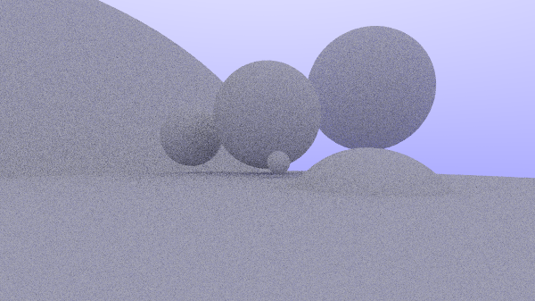

# ray-tracing

This project is a first pass at learning and creating a ray tracing program in c++.

We closely follow Peter Shirleys, [*Ray Tracing in One Weekend*](https://raytracing.github.io/books/RayTracingInOneWeekend.html), with
possible continuation into Shirley's next book(s) in the [series](https://raytracing.github.io/).

## Getting Started

This project was created using *Microsoft Visual Studio 2019 - Community Edition*.

Headers can be included from the `include/` directory. The visual studio settings are set to include the `include/` directory when resolve `#include`'s.
